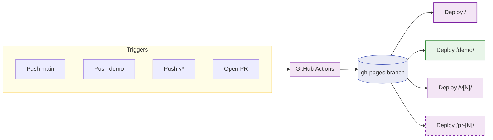

# WebResume 🌐 💻 📄

A modern, interactive web-based resume — dynamic content loading, dark mode, live editing, and print-ready layout.

[](https://hellosaumil.github.io/WebResume)
[](https://hellosaumil.github.io/WebResume/demo/)
[](https://github.com/hellosaumil/WebResume/actions)
[](#license)

<p align="center">
  
  
</p>

## 💡 Why did I build this?

### The Why?
On the onset of 2026, I wanted to revamp my resume since I last updated it in 2020 after my post-graduation.
My resume lived in an `Apple Pages` template I hand-crafted in 2017 — custom fonts, pixel-perfect spacing, the best I could do at the time. Five years of "just one more tweak" later, spending 20 mins fixing a single bullet point or adding a new project URL was taking more time than it should.
**I wanted something local, easy to edit, maintain, and version control. 💭**
`Google Docs`? Been there, done that, moving text-boxes is not fun. `LaTeX`? Great until you want `_italic-bold-link_` on the same line without selling your soul. `MS Word`? ...let's not.

### The When?
Over the holidays of Christmas 2025, I got my hands on Google's Project Antigravity and vibe-coded a Solar System Android XR app from scratch for my all-new Galaxy XR headset — in a weekend.
As a backend engineer, I've been using AI pair-programming at work to build delightful websites. I thought: why can't I just make a `WebResume` to complement my limited front-end skills?

### The How?
A resume I actually *enjoy* updating — write content in `Markdown`, watch it `render live`, toggle `dark mode` for ✨vibes✨, and hit `Ctrl+P` when a recruiter inevitably asks for a `PDF`.
**No frameworks, no build step, just `HTML + CSS + JS` and a little bit of audacity.**

### Some Design Choices
- **Markdown-first content** — I've been living in `.md` files thanks to LLMs; it's the easiest way to add highlights, links, and formatting without drowning in HTML tags. So I made it the data layer.
- **Versioned deployments** — Because past-me and future-me deserve their own URLs. GitHub Pages + Actions auto-deploy `main`, `demo`, `PR previews`, and `tagged version snapshots` — so every iteration is a living, linkable artifact.

### Closing Notes
I hope this saves time for people who are looking for a simple, local, and easy-to-edit resume template. I hope you enjoy using this resume template as much as I enjoyed building it!

## ✨ Features

- **CSS Inspector** — Hover to inspect font properties

  
  
- **Dark Mode** — Auto-detects device theme with manual toggle

  
- **Dynamic Content Loading** — Resume data from easy-to-edit Markdown files  <!--  -->
- **Live Edit Mode** — All content editable in-browser  <!--  -->
- **Section Reordering** — Drag & drop section titles  <!--  -->
- **Page Preview** — US Letter page constraints & guides  <!--  -->
- **Print Ready** — Optimized for PDF export  <!--  -->

> See [Controls & Features](docs/controls.md) for detailed usage.

## 🚀 Quick Start

```bash
npx serve .          # start local server → open http://127.0.0.1:3000
```

Edit any `.md` file in `data/`, refresh to see changes. See [Data Format](docs/data-format.md) for schemas.

## 📁 Project Structure

```
WebResume/
├── index.html              # Main HTML structure
├── styles.css              # Styling with dark mode support
├── script.js               # Dynamic loading & interactive features
├── DESIGN_SYSTEM.md        # Typography & spacing style guide
├── data/                   # Resume content in Markdown
│   ├── header.md
│   ├── summary.md
│   ├── education.md
│   ├── experience.md
│   ├── projects.md
│   ├── skills.md
│   ├── publications.md
│   ├── leadership.md
│   └── certificates.md
├── docs/                   # Detailed documentation
│   ├── data-format.md
│   ├── controls.md
│   ├── deployment.md
│   └── customization.md
└── .github/workflows/      # CI/CD
    ├── jekyll-gh-pages.yml
    └── pr-preview.yml
```

## 📦 Deployment

Pushes to `main` auto-deploy to GitHub Pages. The `demo` branch deploys to `/demo/`. Tags create frozen version snapshots. PRs get live previews.



> See [Deployment Guide](docs/deployment.md) for versioned deploys, manual triggers, and PR preview details.

## 🛠️ Technologies

- **Frontend**: Pure HTML / CSS / JavaScript (no frameworks)
- **Content**: Markdown for structured data
- **Fonts**: Google Fonts (Google Sans Flex, Space Grotesk)
- **Hosting**: GitHub Pages via `gh-pages` branch
- **CI/CD**: GitHub Actions (production + PR previews)

## 📚 Docs

| Document | Description |
|----------|-------------|
| [Data Format](docs/data-format.md) | Markdown schemas for each resume section |
| [Controls & Features](docs/controls.md) | Floating panel, inspector, drag & drop, link tooltips |
| [Deployment](docs/deployment.md) | Production, versioned, and PR preview deployments |
| [Customization](docs/customization.md) | Theming, section order, style guide |
| [Design System](DESIGN_SYSTEM.md) | Typography hierarchy & spacing conventions |

## Acknowledgements

Thanks to [](https://antigravity.google) [](https://deepmind.google/technologies/gemini/) and [](https://www.anthropic.com/claude) for co-designing the initial version of this resume up till now.

---

## 📄 License

MIT License — feel free to use this template for your own resume!
